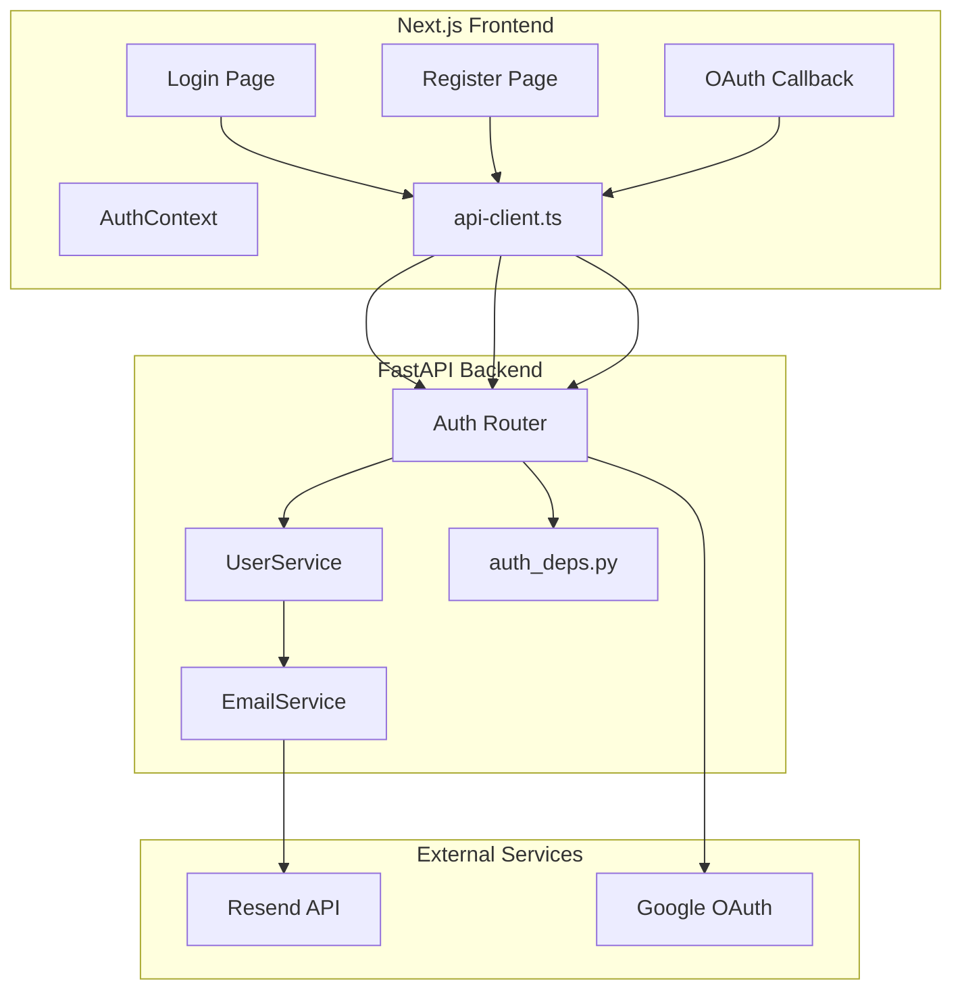
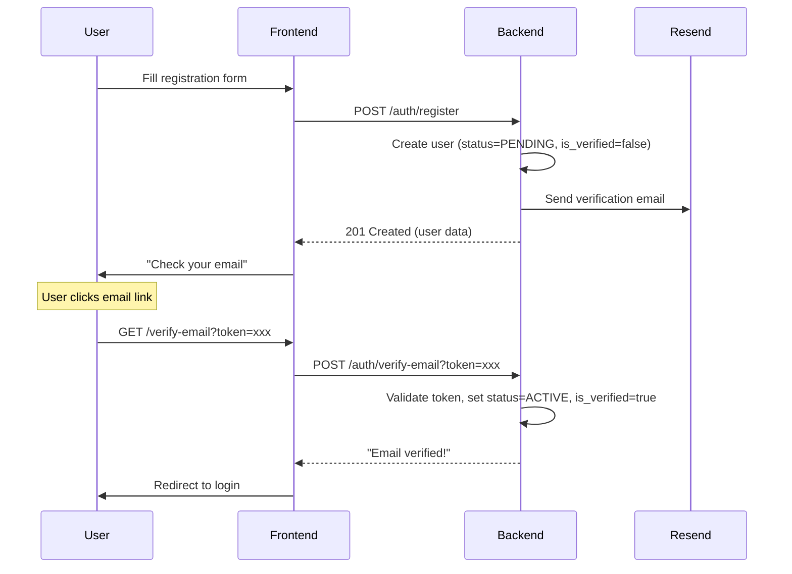
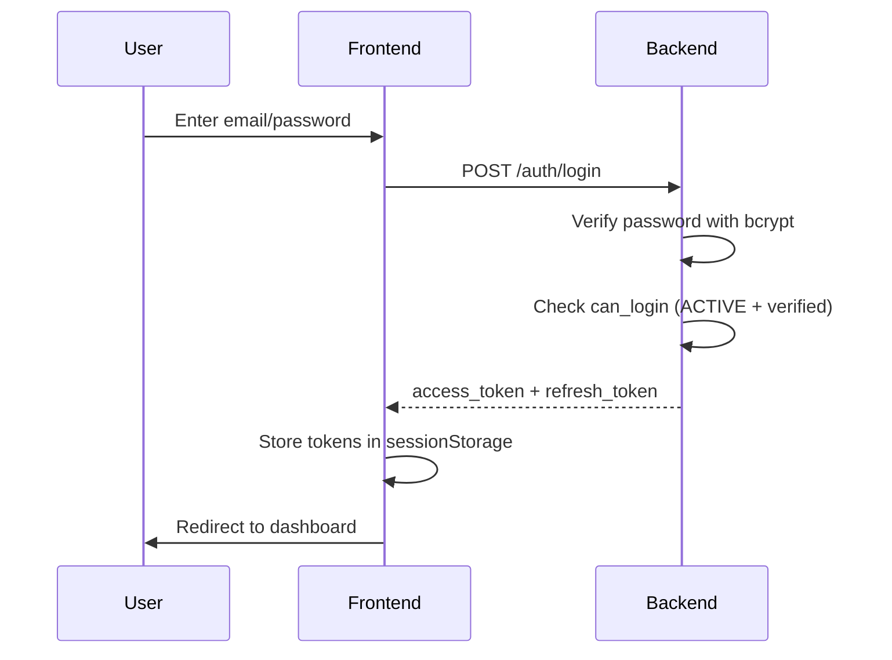
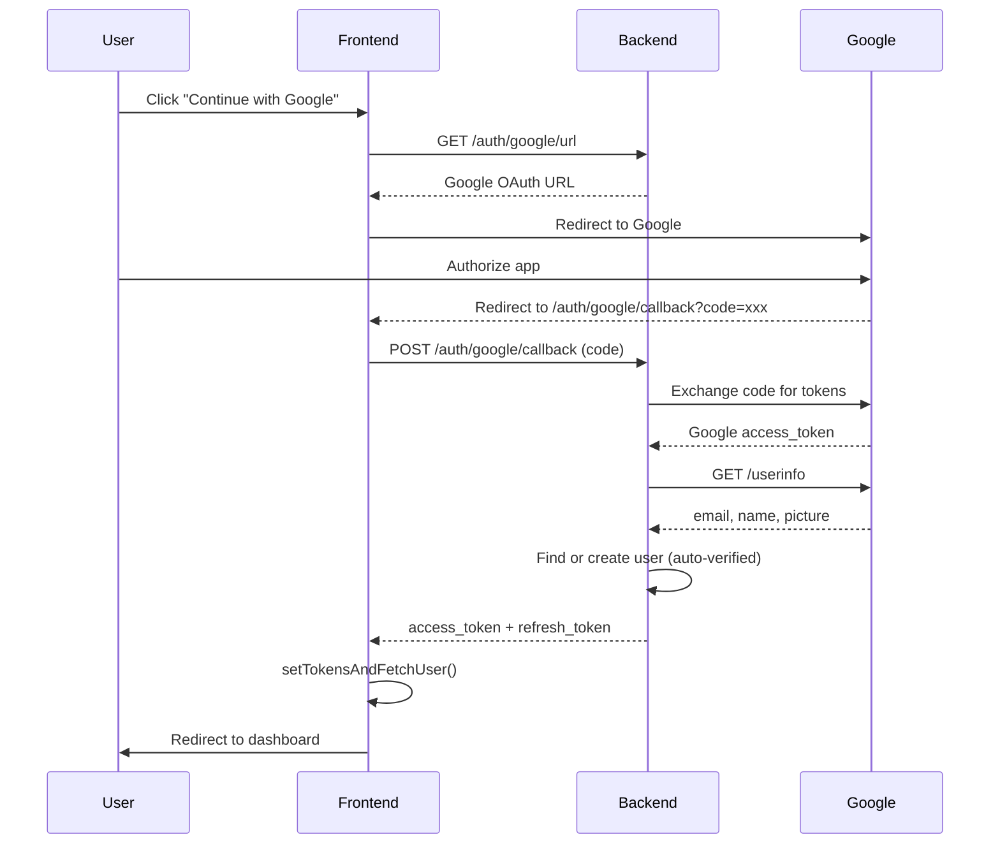
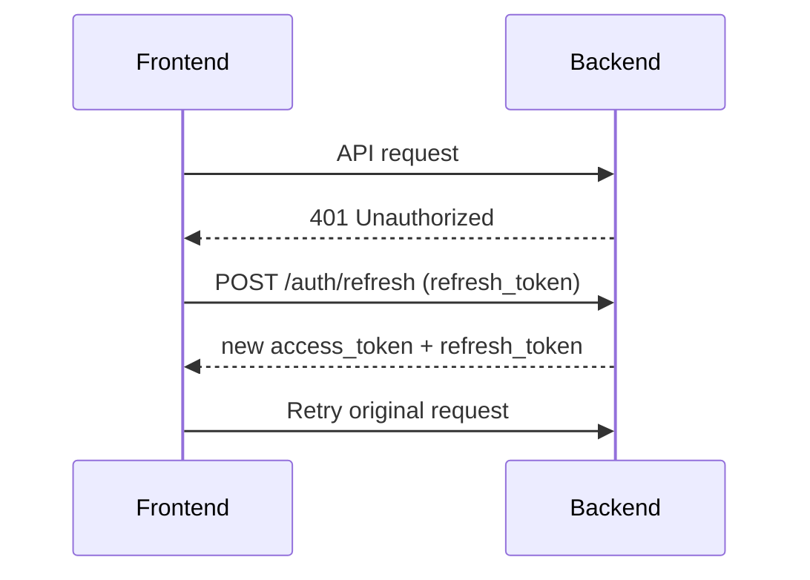

# Auth JWT Fullstack Documentation

Complete authentication system using JWT tokens with email verification, password reset, and Google OAuth.

---

## Overview

This implementation provides a production-ready authentication system for a FastAPI + Next.js stack using:

- **JWT** (HS256) for stateless authentication
- **bcrypt** for password hashing
- **Resend** for transactional emails
- **Google OAuth 2.0** for social login

---

## Architecture



---

## Backend Implementation

### 1. Configuration (`pkg/config/settings.py`)

```python
class Settings(BaseSettings):
    # JWT Configuration
    jwt_secret_key: str = Field(default="your-secret-key-change-me")
    jwt_algorithm: str = Field(default="HS256")
    jwt_access_token_expire_minutes: int = Field(default=30)
    jwt_refresh_token_expire_days: int = Field(default=7)
    
    # Email (Resend)
    resend_api_key: str = Field(default="")
    email_from: str = Field(default="noreply@yourdomain.com")
    app_url: str = Field(default="http://localhost:3000")
    
    # Google OAuth
    google_client_id: str = Field(default="")
    google_client_secret: str = Field(default="")
    google_redirect_uri: str = Field(default="http://localhost:3000/auth/google/callback")
```

### 2. User Entity (`internal/entities/user.py`)

```python
class UserRole(Enum):
    USER = "user"
    ADMIN = "admin"
    SUPER_ADMIN = "super_admin"

class UserStatus(Enum):
    ACTIVE = "active"
    INACTIVE = "inactive"
    SUSPENDED = "suspended"
    PENDING = "pending"  # Awaiting email verification

@dataclass
class User(BaseEntity):
    email: str = ""
    username: str = ""
    hashed_password: str = ""
    first_name: str = ""
    last_name: str = ""
    role: UserRole = UserRole.USER
    status: UserStatus = UserStatus.PENDING
    is_verified: bool = False
    avatar_url: Optional[str] = None
    
    @property
    def can_login(self) -> bool:
        """User must be ACTIVE and verified to login."""
        return self.status == UserStatus.ACTIVE and self.is_verified
```

### 3. JWT Token Functions (`internal/services/auth_deps.py`)

```python
from jose import jwt
from datetime import datetime, timedelta

def create_access_token(data: dict, expires_delta: Optional[timedelta] = None) -> str:
    """Create JWT access token with 'access' type."""
    to_encode = data.copy()
    expire = datetime.utcnow() + (
        expires_delta or timedelta(minutes=settings.jwt_access_token_expire_minutes)
    )
    to_encode.update({"exp": expire, "type": "access"})
    return jwt.encode(to_encode, settings.jwt_secret_key, algorithm=settings.jwt_algorithm)

def create_refresh_token(data: dict) -> str:
    """Create JWT refresh token with 'refresh' type."""
    to_encode = data.copy()
    expire = datetime.utcnow() + timedelta(days=settings.jwt_refresh_token_expire_days)
    to_encode.update({"exp": expire, "type": "refresh"})
    return jwt.encode(to_encode, settings.jwt_secret_key, algorithm=settings.jwt_algorithm)

async def get_current_user(
    credentials: Optional[HTTPAuthorizationCredentials] = Depends(security),
    user_service: UserService = Depends(get_user_service),
) -> User:
    """FastAPI dependency to extract and validate user from JWT token."""
    if not credentials:
        raise HTTPException(status_code=401, detail="Authentication required")
    
    payload = jwt.decode(
        credentials.credentials,
        settings.jwt_secret_key,
        algorithms=[settings.jwt_algorithm],
    )
    
    if payload.get("type") != "access":
        raise HTTPException(status_code=401, detail="Invalid token type")
    
    user = await user_service.get_user(UUID(payload.get("sub")))
    
    if not user.can_login:
        raise HTTPException(status_code=403, detail="Account is not active")
    
    return user
```

### 4. Password Hashing (`internal/services/user_service.py`)

```python
import bcrypt

def _hash_password(password: str) -> str:
    """Hash password using bcrypt. Handles 72-byte limit."""
    password_bytes = password.encode('utf-8')
    if len(password_bytes) > 72:
        password_bytes = password_bytes[:72]
    salt = bcrypt.gensalt()
    return bcrypt.hashpw(password_bytes, salt).decode('utf-8')

def _verify_password(password: str, hashed: str) -> bool:
    """Verify password against bcrypt hash."""
    password_bytes = password.encode('utf-8')
    if len(password_bytes) > 72:
        password_bytes = password_bytes[:72]
    try:
        return bcrypt.checkpw(password_bytes, hashed.encode('utf-8'))
    except Exception:
        return False
```

---

## API Endpoints

### Authentication Routes (`/api/v1/auth/*`)

| Method | Endpoint | Description | Auth |
|--------|----------|-------------|------|
| POST | `/register` | Register new user | ❌ |
| POST | `/login` | Login with email/password | ❌ |
| POST | `/refresh` | Refresh access token | ❌ |
| GET | `/me` | Get current user info | ✅ |
| POST | `/logout` | Logout (client discards tokens) | ❌ |
| POST | `/forgot-password` | Request password reset | ❌ |
| POST | `/reset-password` | Reset password with token | ❌ |
| POST | `/verify-email` | Verify email with token | ❌ |
| POST | `/resend-verification` | Resend verification email | ❌ |
| GET | `/google/url` | Get Google OAuth URL | ❌ |
| POST | `/google/callback` | Handle Google OAuth callback | ❌ |

---

## User Flows

### 1. Email Registration Flow



### 2. Login Flow



### 3. Google OAuth Flow



### 4. Token Refresh Flow



---

## Frontend Implementation

### AuthContext (`context/AuthContext.tsx`)

```typescript
interface AuthContextType {
  user: User | null;
  isLoading: boolean;
  isAuthenticated: boolean;
  login: (data: LoginRequest) => Promise<void>;
  register: (data: RegisterRequest) => Promise<void>;
  logout: () => Promise<void>;
  refreshUser: () => Promise<void>;
  setTokensAndFetchUser: (tokens: TokensData) => Promise<void>;
}
```

Key implementation details:

1. **Token Storage**: Uses `sessionStorage` (not localStorage for security)
2. **Auto-check on mount**: Validates token and fetches user on page load
3. **setTokensAndFetchUser**: Special method for OAuth callbacks to sync auth state before redirect

### API Client Token Handling (`lib/api-client.ts`)

```typescript
// Request interceptor adds auth header
const api = {
  request: async (endpoint: string, options: RequestInit) => {
    const token = sessionStorage.getItem('access_token');
    const headers = {
      'Content-Type': 'application/json',
      ...(token ? { 'Authorization': `Bearer ${token}` } : {}),
    };
    // ... fetch with error handling
  }
};

// Login saves tokens automatically
authApi.login = async (data) => {
  const response = await api.post('/auth/login', data);
  sessionStorage.setItem('access_token', response.tokens.access_token);
  sessionStorage.setItem('refresh_token', response.tokens.refresh_token);
  return response;
};
```

### Protected Route Pattern (`dashboard/page.tsx`)

```typescript
export default function DashboardPage() {
  const { isAuthenticated, isLoading } = useAuth();
  const router = useRouter();

  useEffect(() => {
    if (!isLoading && !isAuthenticated) {
      router.replace('/login');
    }
  }, [isAuthenticated, isLoading, router]);

  if (isLoading) {
    return <div>Loading...</div>;
  }

  if (!isAuthenticated) {
    return <div>Redirecting...</div>;
  }

  return <Dashboard />;
}
```

---

## Email Verification Token Entity

```python
@dataclass
class VerificationToken(BaseEntity):
    user_id: UUID
    token: str  # Generated with secrets.token_urlsafe(32)
    token_type: str = "email_verification"
    expires_at: Optional[datetime] = None  # Default: 24h for verify, 1h for reset
    used_at: Optional[datetime] = None
    
    @property
    def is_valid(self) -> bool:
        return not self.is_expired and not self.is_used
```

---

## Security Considerations

1. **Password Hashing**: bcrypt with salt, handles 72-byte limit
2. **Token Types**: Separate `access` and `refresh` token types to prevent misuse
3. **Token Expiry**: Short-lived access tokens (30min), longer refresh tokens (7 days)
4. **Email Enumeration Prevention**: `/forgot-password` and `/resend-verification` always return success
5. **Session Storage**: Tokens stored in sessionStorage (cleared on browser close)
6. **HTTPS Required**: All auth endpoints should be behind HTTPS in production
7. **Google OAuth Users**: Auto-verified (Google already verified their email)

---

## Environment Variables

```bash
# JWT
JWT_SECRET_KEY=your-256-bit-secret-key-here
JWT_ALGORITHM=HS256
JWT_ACCESS_TOKEN_EXPIRE_MINUTES=30
JWT_REFRESH_TOKEN_EXPIRE_DAYS=7

# Email (Resend)
RESEND_API_KEY=re_xxxxxxxxxxxxxxxxxxxxxxxx
EMAIL_FROM=noreply@yourdomain.com
APP_URL=https://yourdomain.com

# Google OAuth
GOOGLE_CLIENT_ID=xxxxx.apps.googleusercontent.com
GOOGLE_CLIENT_SECRET=GOCSPX-xxxxxxxxxx
GOOGLE_REDIRECT_URI=https://yourdomain.com/auth/google/callback
```

---

## File Structure

```
backend/
├── api/http/
│   └── auth.py              # Auth endpoints
├── internal/
│   ├── entities/
│   │   ├── user.py          # User entity
│   │   └── verification_token.py
│   ├── services/
│   │   ├── auth_deps.py     # JWT functions, FastAPI deps
│   │   ├── user_service.py  # User business logic
│   │   └── email_service.py # Resend integration
│   └── adapters/db/
│       ├── user_repo.py
│       └── verification_token_repo.py
└── pkg/config/
    └── settings.py          # All configuration

frontend/
├── src/
│   ├── context/
│   │   └── AuthContext.tsx  # Auth state management
│   ├── lib/
│   │   └── api-client.ts    # API client with token handling
│   └── app/
│       ├── login/page.tsx
│       ├── register/page.tsx
│       ├── verify-email/page.tsx
│       ├── forgot-password/page.tsx
│       └── auth/google/callback/page.tsx
```

---

## Dependencies

### Backend (requirements.txt)
```
python-jose[cryptography]>=3.3.0
bcrypt>=4.0.0
pydantic-settings>=2.0.0
resend>=2.0.0
httpx>=0.24.0  # For Google OAuth
```

### Frontend (package.json)
```json
{
  "dependencies": {
    "next": "^14.0.0",
    "react": "^18.0.0"
  }
}
```

---

## Quick Start

1. Set environment variables (see above)
2. Run database migrations: `alembic upgrade head`
3. Start backend: `uvicorn main:app --reload`
4. Start frontend: `npm run dev`

---

## Testing Endpoints

```bash
# Register
curl -X POST http://localhost:8000/api/v1/auth/register \
  -H "Content-Type: application/json" \
  -d '{"email":"test@example.com","password":"password123"}'

# Login
curl -X POST http://localhost:8000/api/v1/auth/login \
  -H "Content-Type: application/json" \
  -d '{"email":"test@example.com","password":"password123"}'

# Get current user (with token)
curl http://localhost:8000/api/v1/auth/me \
  -H "Authorization: Bearer <access_token>"
```
